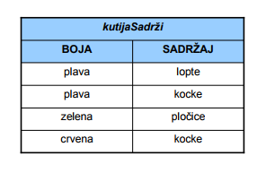
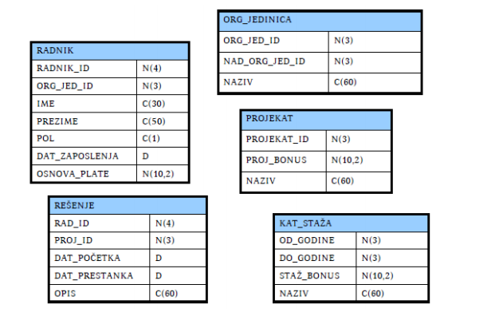

## 11. Sta je "strukturni deo relacionog modela"? Objasniti ukratko. ##

Strukturni deo relacionog modela opisuje nacin modeliranja podataka.
Dva osnovna tipa objekata koji karakterisu strukturu relacionog modela su:

- domen
- relacija

Domen predstavlja skup vrednosti istog tipa (na primer, skup naslova knjiga,
skup imena gradova ili skup datuma nekih dogadjaja). 

Neka je *D1 × D2 × ... × Dn* Dekartov proizvod domena *D1, D2, . . . , Dn*. Tada relacija R stepena *n* (n-arna relacija), definisana na domenima *D1, D2, . . . , Dn* predstavlja proizvoljni konacni podskup navedenog Dekartovog proizvoda. 

Za razliku od matematickog pojma relacije, ova relacija je dinamickog sadrzaja jer se neke njene n-torke tokom "zivota" relacije brisu, neke se dodaju a neke se menjaju.

### Matematicke osnove ###

Relacioni model je u potpunosti formalno matematicki zasnovan. To je neprotivrecan i nedvosmislen model. Ovde cemo navesti samo okvire te formalizacije u sirini i dubini koje omogucavaju dalji rad.

### Model relacije ###

Svakoj matematickoj relaciji odgovara tacno jedan skup objekata koji zadovoljavaju relaciju. Taj skup se cesto upotrebljava kao matematicki model relacije.
Ako je *ρ* n-arna relacija i njen domen oznacen sa *Dom(ρ)*, onda je jedan model relacije *ρ* skup:

*model(ρ) = {(a1, a2, ..., an)|(a1, a2, ..., an) ∈ Dom(ρ) ∧ ρ(a1, a2, ..., an)}*

Primetimo da vazi:

*model(ρ) ⊂ Dom(ρ)*.

## 12. Sta je "manipulativni deo relacionog modela"? Objasniti ukratko. ##

Manipulativni deo relacionog modela opisuje nacin rukovanja modeliranim podacima.

## 13. Sta je "integritetni deo relacionog modela"? Objasniti ukratko. ##

Integritetni deo relacionog modela koji opisuje nacin obezbedjivanja valjanosti podataka.

## 14. Navesti primer modeliranja skupa iz posmatranog domena odgovarajucom relacijom. ##

### Predstavljanje relacija skupovima ###

Za sve n-torke iz *Dom(ρ)* vazi:

*ρ(a1, a2, ..., an) ⇐⇒ (a1, a2, ..., an) ∈ model(ρ)*

Zbog navedene ekvivalencije cesto se umesto oznake *model(ρ)* upotrebljava samo
relacija ρ u istom kontekstu:

*ρ = {(a1, a2, . . . , an)|(a1, a2, . . . , an) ∈ Dom(ρ) ∧ ρ(a1, a2, . . . , an)}*

Relacije cesto predstavljamo upravo pomocu njihovog modela.

### Predstavljanje relacije skupovima - primer ###

Neka imamo:

- crvenu, plavu, belu i zelenu kutiju
- i u njima lopte, kocke i plocice.

Neka je data binarna relacija *kutijaSadrzi(K, P)* koja je zadovoljena ako kutija
*K* sadrzi *P*. Njen domen je tada definisan na sledeci nacin:

*Dom(kutijaSadrzi) = {crvena, plava, bela, zelena} × {lopte, kocke, plocice}*

Neka naredni model relacije opisuje sta se nalazi u kojoj kutiji:

*kutijaSadrzi = {(plava, lopte),(plava, kocke),(zelena, plocice),(crvena, kocke)}*

Tada:

- iskaz *kutijaSadrzi(plava, kocke)* je tacan,
- iskaz *kutijaSadrzi(zelena, lopte)* nije tacan,
- iskazi *kutijaSadrzi(zuta, kocke)* i *kutijaSadrzi(zelena, knjige)* nisu definisani, zato ˇto argumenti nisu u domenu relacije.

Relacije (odnosno njihovi modeli) sa konacnim brojem elemenata mogu da se
predstave i pomocu tabela:

## 15. Sta su entiteti? Kako se formalno definisu atributi i relacije? ##

Entitetima nazivamo neke objekte "stvarnog" sveta koje modeliramo i opisujemo
nekim skupom podataka. Neka je *E* neki skup entiteta. Tada kazemo da se skup entiteta karakterise konacnim skupom atributa *A1, A2, . . . An*, u oznaci
*E(A1, A2, . . . An)*, akko:

- Svaki atribut *Ai* predstavlja funkciju koja slika entitete u odgovarajuci domen atributa *Di*:

*Ai : E → Di*

- Svaki atribut *Ai* i ima jedinstven naziv *ti*

Za svaki entitet *e ∈ E*, vrednost funkcije *Ai(e) ∈ Di * predstavlja njegovu vrednost atributa *Ai*.

## 16. Sta je relaciona baza podataka? Sta je relaciona shema? ##

*Relaciona baza podataka* je skup relacija. Opis relacije cine domen relacije i
nazivi atributa. Oznaka *R(A1 : D1, A2 : D2, . . . , An : Dn)* koristi se za predstavljanje relacije R ciji atribut *Ai* uzima vrednost iz domena *Di*, za 
*i = 1, . . . , n*, i zove se *relacijska shema relacije R*. Skup relacijskih shema relacione baze podataka je *shema relacione baze podataka*.

### Primer baze podataka - tipovi ###

Uvedimo opisno sledece skupove:

- *N(a)* = skup svih celih brojeva sa najvise a dekadnih cifara
- *N(a, b)* = skup svih brojeva koji u dekadnom zapisu sa leve strane decimalne
zapete imaju najvise *a*, a sa desne strane najvise *b* cifara
- *C(a)* = skup svih niski duzine do *a* znakova
- *D* = skup svih datuma (u nekom podrazumevanom opsegu)

Navedeni skupovi se najcesce upotrebljavaju kao domeni (tj. tipovi) atributa
relacija. Svi atributi u narednom primeru relacione baze podataka imaju za
domen neki od navedenih skupova.

### Primer baze podataka - shema ###

*Kol(ORG_JEDINICA) = ('org_jed_id', 'nad_org_jed_id', 'naziv')*

*Dom(ORG_JEDINICA) = N(3) × N(3) × C(60)*

*Kol(RADNIK) = ('radnik_id', 'org_jed_id', 'ime', 'prezime', 'pol', 'dat_zaposlenja', 'osnova plate')*

*Dom(RADNIK) = N(4) × N(3) × C(30) × C(50) × C(1) × D × N(10, 2)*

*Kol(PROJEKAT) = ('projekat_id', 'proj_bonus', 'naziv')*

*Dom(RADNIK) =  N(3) × N(10, 2) × C(60)*

## 17. Kako se modeliraju entiteti posmatranog domena u relacionom modelu? ##

### Modeliranje entiteta relacijama ###

U opstem slucaju, skup svih atributa *A1, . . . An* entiteta *e ∈ E* odredjuje funkciju *α* na sledeci nacin:

*α(e) = (A1(e), . . . An(e))*

Slika skupa entiteta funkcijom *α* je skup:

*R = α(E)*

Podsetimo se, funkcija *α* je injektivna akko za sve razlicite originale daje razlicite slike, tj. akko vazi:

*α(e) = α(u) akko e = u*.

Kazemo da skup atributa dobro karakterise skup entiteta ako, pored navedenih
uslova, funkcija predstavlja injektivno preslikavanje.
Ako je *α* injektivna funkcija, tada kazemo da je slika *R = α(E)*:

- relacija *R* sa atributima *A1, . . . An*,
- domenom relacije *Dom(R) = D1 × · · · × Dn*,
- i nazivima atributa *Kol(R) = (t1, . . . tn).*

Tada skup entiteta *E* sa atributima *A1, . . . An* modeliramo relacijom *R* i relacija *R* je dobra karakterizacija skupa entiteta *E*. Formalno, definisemo *R* tako da je *model(R) = α(E).*

### Zapisivanje ###

Ako je *α(e) = (a1, . . . an)*, tada n-torku *(a1, . . . an)*, koja formalno predstavlja "model entiteta e", ˇcesto nazivamo i "entitetom ". Atribut *Ai(e)* zapisujemo i kao e.ti. Namerno ne pravimo razliku izmedju relacije *R* i odgovarajucih relacija dobijenih permutovanjem njenih atributa.

### Predstavljanje relacije tabelom ###

Relaciju *R = α(E)* cesto predstavljamo, pa i nazivamo, tabelom. Pri tome:

- Kolone tabele odgovaraju atributima *A1, . . . An*;
- Nazivi kolona odgovaraju nazivima atributa *t1, . . . tn*;
- Vrste tabele odgovaraju torkama relacije, tj. entitetima.

### Predstavljanje entiteta - primer ###

Relacija ne sme da ima jednake elemente:

Ako je

*α(x) = (ime(x), prezime(x), osnova plate(x))*

onda cemo n-torku *(ime(x), prezime(x), osnova plate(x))* u zapisima obicno da
izjednacavamo sa *x*. Pri tome cemo *ime(x)* da zapisujemo kao *x.ime* (i slicno
za ostale atribute). Necemo razlikovati relaciju *RADNIK* od relacija dobijenih
permutovanjem atributa ove relacije.

## 18. Kako se modeliraju odnosi u posmatranom domenu u relacionom modelu? ##

U relacionom modelu, odnosi se modeliraju na isti nacin kao i entiteti – relacijama. Bez mnogo formalizovanja, pogledajmo prethodni primer i videcemo da
vec imamo neke odnose:

- Svaki *RADNIK* ima dodeljen tacno jednan entitet *ORG_JEDINICA*.
- Svako *RESENJE* predstavlja odnos tacno jednog entiteta *RADNIK* i tacno jednog entiteta *P ROJEKAT*, uz jos neke dodatne atribute.

Osnovna ideja je sasvim jednostavna:

- Ako su dva entiteta *e ∈ E* i *f ∈ F* u nekom odnosu, onda to mozemo opisati novom relacijom *ρ(e, f)*, ciji je domen *Dom(ρ)*
- Ako su entiteti *e ∈ E* i *f ∈ F* modelirani kao *e = (x1, . . . , xn)*, *f = (y1, . . . ym)* onda njihov odnos moze da se modelira kao *ρ(e, f) = (x1, . . . , xn, y1, . . . ym)*

Ako postoji podskup atributa *Ai1, . . . , Aink* takav da postoji preslikavanje *k*, koje za svaki entitet *e* iz *E* jednoznacno preslikava izabrani podskup atributa *xi1, . . . xink* entiteta *e* u kompletan model entiteta *e(x1, . . . , xn)*, onda u modelu relacije *ρ* taj skup atributa moze da se koristi umesto punog skupa atributa *A1, . . . , An*.

## 19. Sta cini manipulativni deo relacionog modela? ##

Kljucno mesto u manipulativnom delu modela ima pojam upita. Upit se moze
definisati kao definicija nove relacije na osnovu vec postojecih i poznatih relacija baze podataka.

### Formalni upitni jezici ###

Definicija relacionog modela ukljucuje dva formalna jezika za rad sa relacijama:

- Relaciona algebra i
- Relacioni racun

Po pitanju izrazajne moci, dokazana je ekvivalentnost ovih formalizama.

###Optimizacija upita i baze podataka ###

Iz ugla teorije, kljucno je da se utvrdi da je upitni jezik dovoljno dobar da se
njime moˇze iskazati bilo koji upit. U praksi je potrebna i efikasnost. Optimizacija upita obuhvata poslove analize upita i pronalazenja najefikasnijeg
puta za njegovo izracunavanje. Relacioni upitni jezici omogucavaju relativno
jednostavno automatsko modifikovanje, pa time i optimizaciju, imajuci u vidu
formalnu zasnovanost.

Optimizacija baze podataka obuhvata poslove analize (stvarne ili procenjene)
upotrebe i projektovanja fizickog modela baze podataka u cilju omogucavanja
sveukupno efikasnijeg rada sistema. Pored azuriranja upita, vazno mesto zauzima
azuriranje baze podataka. Ima vise pristupa, ali sustina je da zahteva prosirenja i nove pojmove:

- relaciona promenljiva
- relacija  
= relaciona vrednost  
= sadrzaj relacione promenljive
- promenljiva baze podataka
- vrednost baze podataka

Azuriranje baze podataka je zamenjivanje vrednosti promenljive baze podataka
novom vrednoscu baze podataka.

## 20. Objasniti ukratko relacioni racun. ##

Relacioni racun je zasnovan na predikatskom racunu prvog reda.

### Primeri upita ###

**Primer 1**: Naredni upit izdvaja muskarce koji imaju osnovu plate manju od
32000: 

*{x|x ∈ RADNIK ∧ x.pol = 'M' ∧ x.osnova plate < 32000}*

**Primer 2**: Ako nas zanimaju imena, prezimena i datumi zaposlenja radnika koji
zaradjuju bar 40000, onda je resenje naredni upit:

*{(x.ime, x.prezime, x.dat zaposlenja)|x ∈ RADNIK∧x.osnova plate ≥ 40000}*

**Primer 3**: Imena i prezimena zaposlenih u "Planiranju", ciji staz ulazi u kategoriju "Srednja":

*{(x.ime, x.prezime)| 
x ∈ RADNIK 
∧(∃y ∈ ORG_JEDINICA) 
(y.naziv = 'Planiranje' 
∧x.org jed id = y.org jed id) 
∧(∃z ∈ KAT_STAZA) 
(z.naziv = 'Srednja' 
∧z.od godine ≤ staz(x) ≤ z.do godine) 
}*

